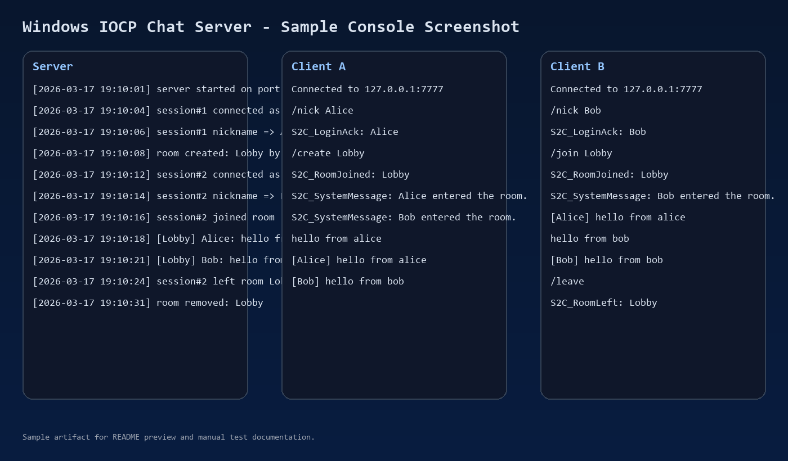

# Windows IOCP Chat Server

Minimal Windows IOCP-based TCP chat server for validating core game server fundamentals.

## Overview

This project intentionally stays small and focused:

- C++
- TCP
- length-header packet protocol
- multi-client connections
- nickname setup
- room create / join / leave
- room broadcast
- disconnect cleanup
- server logging
- simple console test client

The following are intentionally out of scope:

- DB
- Redis
- GUI client
- file transfer
- whisper / friends / block / emoji
- reconnect recovery
- TLS / encryption
- admin page

## Core Structure

- `Session`
  - Owns a client socket, async recv/send state, nickname, and current room state.
- `Room`
  - Tracks room members and provides a snapshot for room broadcasts.
- `PacketParser`
  - Accumulates TCP stream bytes and splits complete packets by length header.
- `Server`
  - Owns IOCP, `AcceptEx`, session/room maps, packet dispatch, and disconnect cleanup.

## Packet Flow

```text
recv
-> append to buffer
-> complete packet
-> dispatch
-> room broadcast
```

## Project Layout

```text
IocpChatServer.sln
Common/
  Protocol.h
ChatServer/
  Main.cpp
  Server.h / Server.cpp
  Session.h / Session.cpp
  Room.h / Room.cpp
  PacketParser.h / PacketParser.cpp
ChatClient/
  Main.cpp
docs/
  protocol.md
  test-scenario.md
  sample-screenshot.png
  sample-screenshot.svg
```

## Protocol Summary

Full details are in [docs/protocol.md](./docs/protocol.md).

- header: `uint16 packetSize + uint16 packetType`
- string field: `uint16 length + bytes`
- max packet size: `4096`

## Build

1. Open [IocpChatServer.sln](./IocpChatServer.sln) in Visual Studio 2022.
2. Select `x64 / Debug` or `x64 / Release`.
3. Build the solution.

Built binaries are generated under:

- `x64/Debug/ChatServer/ChatServer.exe`
- `x64/Debug/ChatClient/ChatClient.exe`

## Run

Server:

```powershell
.\x64\Debug\ChatServer\ChatServer.exe 7777
```

Client:

```powershell
.\x64\Debug\ChatClient\ChatClient.exe 127.0.0.1 7777
```

Client commands:

```text
/nick Alice
/create Lobby
/join Lobby
/leave
/quit
```

Any non-command input is sent as a chat message.

## Manual Test

Detailed steps are in [docs/test-scenario.md](./docs/test-scenario.md).

Quick test:

1. Run the server.
2. Run client A and enter:

```text
/nick Alice
/create Lobby
hello from alice
```

3. Run client B and enter:

```text
/nick Bob
/join Lobby
hello from bob
```

4. Confirm both clients receive room messages.
5. Enter `/leave` on client B.
6. Close one client and confirm server disconnect cleanup logs.

## Sample Screenshot

PNG:



Vector version:

- [docs/sample-screenshot.svg](./docs/sample-screenshot.svg)

## Design Notes

- TCP is a byte stream, so packet boundaries must be reconstructed from the length header.
- On disconnect, the session is removed from its room so stale room membership does not remain.
- Room membership and packet broadcasting are separated to keep responsibilities clear.
